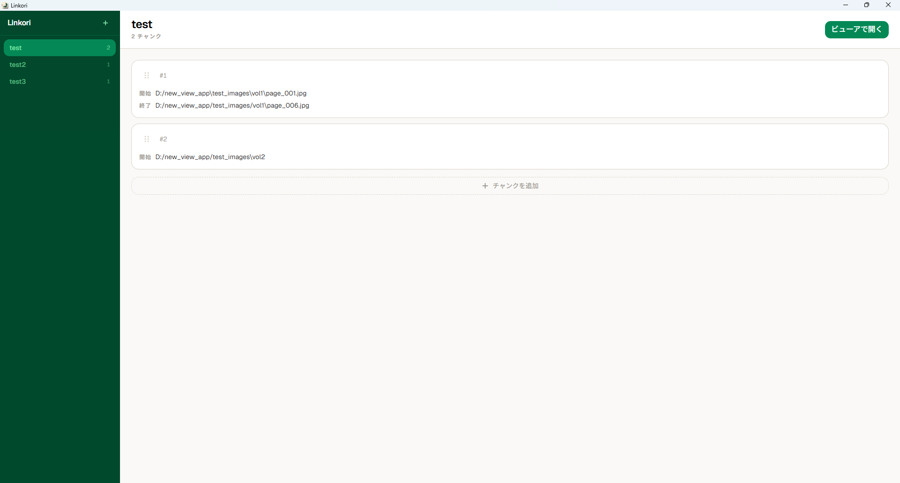
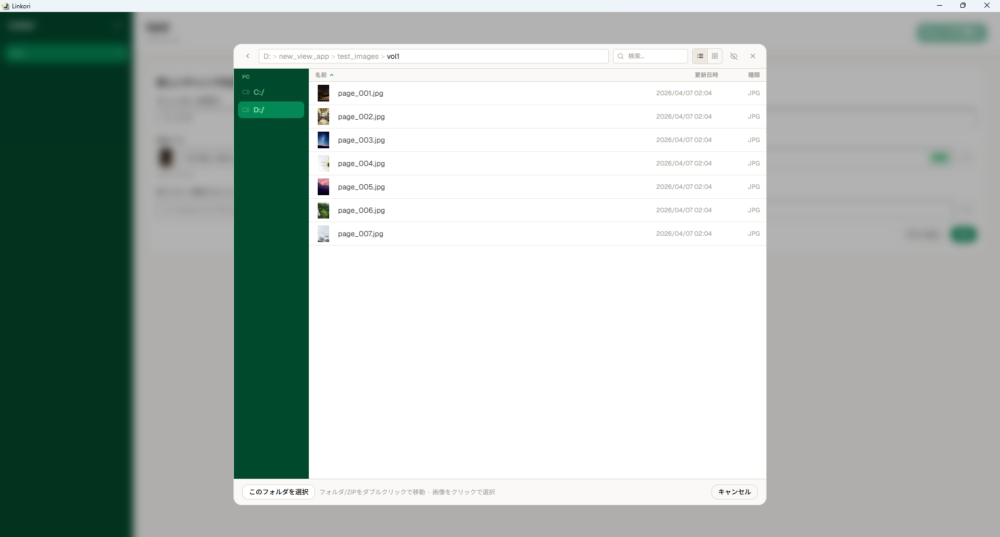
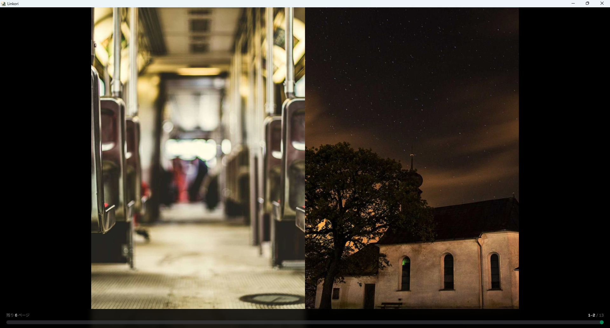

# Linkori

[English](README.md) | **日本語**

プレイリストで複数フォルダ・ZIPを連続閲覧できるローカル漫画ビューア。

**[公式サイト](https://tmd-0x5a.github.io/linkori/)** | **[ダウンロード](https://github.com/tmd-0x5a/linkori/releases/latest)**

## スクリーンショット

**プレイリスト画面**


**ファイルブラウザ**


**ビューア画面**


## ダウンロード

[**Releases**](https://github.com/tmd-0x5a/linkori/releases) ページから最新の `Linkori_x.x.x_x64-setup.exe` をダウンロードしてください。

| ファイル | 説明 |
|---|---|
| `Linkori_x.x.x_x64-setup.zip` | インストーラー（推奨）— 解凍後 `setup.exe` を実行 |
| `Linkori_x.x.x_x64_en-US.zip` | MSI インストーラー — 解凍後 `.msi` を実行 |

### 動作環境
- Windows 10 / 11（x64）
- WebView2 ランタイム（Windows 11 は標準搭載、Windows 10 は自動インストール）

---

## 機能

### プレイリスト管理
- プレイリストの作成・削除・名前変更
- プレイリストはローカルストレージに自動保存（アプリ再起動後も維持）
- 複数プレイリストの切り替え
- **右クリックで名前変更・削除メニューを表示**
- ダブルクリックでその場で名前変更
- `F2` で選択中のプレイリストをリネーム、`Delete` で削除確認ダイアログを表示

### チャンク（読書範囲）
- 開始ファイル〜終了ファイルの範囲を「チャンク」として登録
- チャンクをドラッグ＆ドロップで並び替え
- ディレクトリ内の画像・ZIPファイル内の画像どちらも対応
- 複数チャンクを連結して1つのプレイリストとして閲覧可能
- **開始パスにフォルダ・ZIPを指定すると、そのフォルダ/ZIP全体を対象にできる**（終了パス不要）
- ZIP内サブディレクトリの指定にも対応
- **右クリックで編集・削除メニューを表示**（常時表示ボタンを廃止してUIをすっきりさせた）
- **逆順表示**: 終了ファイルが開始ファイルより前（例: `027.jpg` → `001.jpg`）の場合、画像を逆順で提供
- **プレビュー**: チャンクカードの目のアイコンをクリックすると、ビューアを開く前にサムネイルで画像を確認可能
- **枚数バッジ**: 各チャンクカードに画像枚数を表示

### ファイルブラウザ（オリジナルエクスプローラー）
- OS準拠のネイティブダイアログを使わず、アプリ内蔵のエクスプローラーでファイル選択
- **左サイドバー**にPC上の全ドライブを動的表示（実在するドライブのみ）
- アドレスバー（パンくずリスト）をクリックして直接パス入力可能
- **表示モード切り替え**：リスト表示 / グリッド表示（サムネイル大）
- **ソート**：名前順・更新日時順、昇順/降順をカラムヘッダークリックで切り替え（ソート順・表示モードはパス移動後やダイアログを閉じても記憶）
- 更新日時をリスト表示の列として表示
- ディレクトリ・ZIPファイル（.zip / .cbz）の階層ナビゲーション
- ZIP内サブディレクトリへの入り込みに対応
- Shift-JIS（CP932）エンコードのファイル名を正しく表示（日本語 ZIP 対応）
- サムネイル遅延読み込み（隠しファイルはデフォルト非表示）
- 「このフォルダを選択」「このZIPを選択」ボタンでフォルダ・ZIP丸ごと選択可能
- **終了パス制限**: 終了パスの選択は開始パスと同じフォルダ/ZIP内のみに制限

### 言語切り替え
- 設定メニューから UI 言語を **日本語 / English** に切り替え可能
- 言語設定は次回起動時にも引き継がれます

### ビューア
- **1枚表示 / 2枚見開き表示** を切替可能
- 右→左読み（日本の漫画）固定
- ページ遷移アニメーション
- フルスクリーン表示
- **高速起動**: ビューアを開いた瞬間に表示を開始 — 画像は読み進めながら必要なページのみ読み込む遅延読み込み方式。大量画像のプレイリストや大型ZIPでも待ち時間なし
- **閲覧位置の記憶**: ホームに戻っても、プレイリストごとに最後に見ていたページと表示設定（1枚/2枚表示）を自動保存・復元。アプリを閉じても次回起動時に引き継ぎ
- **シークバーサムネイル高速化**: 現在ページ付近から優先的にサムネイルを生成。既に読み込み済みの画像はブラウザ側で即座にリサイズするためIPC不要
- **部分失敗時の警告**: 一部チャンクが読み込めなくても残りが表示できる場合は、ビューア上部に閉じられる警告バナーを表示して失敗したチャンクを通知 — 他のチャンクはそのまま閲覧可能

#### 操作方法

| 操作 | 動作 |
|------|------|
| マウスホイール ↓ | 次ページ |
| マウスホイール ↑ | 前ページ |
| `←` / `↑` | 次ページ |
| `→` / `↓` | 前ページ |
| `Space` | 次ページ |
| `Shift + Space` | 前ページ |
| `PageDown` | 次ページ |
| `PageUp` | 前ページ |
| `Home` | 最初のページへ |
| `End` | 最後のページへ |
| `S` | 1枚 / 2枚 切替 |
| `[` | 次のチャンクへ |
| `]` | 前のチャンクへ |
| `F` | フルスクリーン切替 |
| `Esc` | フルスクリーン解除 / ホームに戻る |
| 画面右半分クリック | 前ページ |
| 画面左半分クリック | 次ページ |

#### ページバー（下部・ホバーで表示）
- 残りページ数・現在ページ / 全ページ数 を表示
- プログレスバー（右→左方向）をドラッグ or クリックでシーク
- **チャンク可視化**: プログレスバー上にチャンク境界のティックマークを表示 — クリックでそのチャンクの先頭へジャンプ
- **チャンクナビボタン**: プログレスバーの両端に前・次チャンクボタンを表示
- 複数チャンクのプレイリストでは現在のチャンク名（またはチャンク番号）を中央に表示

## 対応画像フォーマット

JPEG / PNG / GIF / WebP / BMP / TIFF

## 対応アーカイブ

`.zip` / `.cbz`（ZIP内画像・ZIP内ディレクトリに対応）

## セキュリティ

- **Zip Slip 対策**: ZIPエントリパスの `..` トラバーサルを検出・拒否
- **パストラバーサル対策**: `manga://` プロトコルハンドラーおよびチャンク解決時にパス検証を実施
- **ファイルサイズ上限**: ZIP展開時に 200MB の上限を設定（DoS対策）
- **CSP**: `manga://` プロトコルのみを `img-src` に許可

## データ保存場所

プレイリスト・チャンクデータはローカルに保存されます。

```
C:\Users\<ユーザー名>\AppData\Roaming\com.linkori.app\
```

アンインストール後もデータは残ります。完全に削除したい場合は上記フォルダを手動で削除してください。

---

## 免責事項

- 本ソフトウェアは現状有姿（AS IS）で提供されます。
- 使用によって生じたいかなる損害についても、作者は責任を負いません。
- 著作権で保護されたコンテンツの取り扱いは、ユーザー自身の責任において適法に行ってください。
- 本ソフトウェアはローカル環境のみで動作し、外部サーバーへのデータ送信は一切行いません。

---

## ライセンス

MIT License

---

## 開発

```bash
# フロントエンド開発サーバー
npm run dev

# Tauri 開発（ホットリロードあり）
npm run tauri dev

# プロダクションビルド
npm run build
npm run tauri build
```

### 必要環境
- Node.js
- Rust / Cargo
- Tauri v2 CLI
